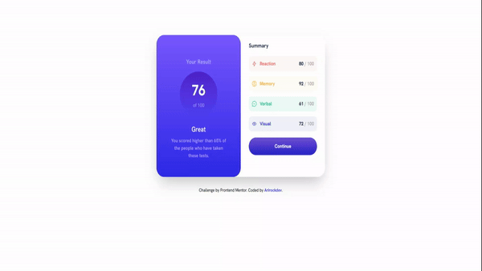

#  Results summary component
   
  This is a reverted mentor frontend challenge, it is a simple card, with a few summary items.

  In the first version of this project i only used html and css, but in this i use tailwind in a reversion to the last proyect.

  I hope you like it.

## Features of the app

- Mobile-friendly reponsive interface
- Modern desing with tailwind


## Proyecto demostration





## I used to complete this Result summary component this technologies:

  " This project was developed with HTML, CSS, AND Javascript. Originally this project did not include javascript, but I decided to make it a little more complex and I have included javascript. " 


#### Live demo project [here](https://arirockdev.github.io/results-summary-component-with-tailwindCss/)
If you want to try:

1. Clone the repository

```bash
https://github.com/Arirockdev/results-summary-component-with-tailwindCss.git
```

2. open the `index.html` file in your browser


## For the app i used

- HTML

- Css and Css Tailwind

- Javascritp:

  I created a json file with all the item data, and I used a fetch to use the API and print them to the dom. I chose to do it this way to give a little variety to the original challenge, which is also a little easier and simpler than this one.
  


### This project belongs to the following [Frontend Mentor](https://www.frontendmentor.io/) challenge You can check it [here](https://www.frontendmentor.io/challenges/results-summary-component-CE_K6s0maV)


**Have fun building!** 🚀
